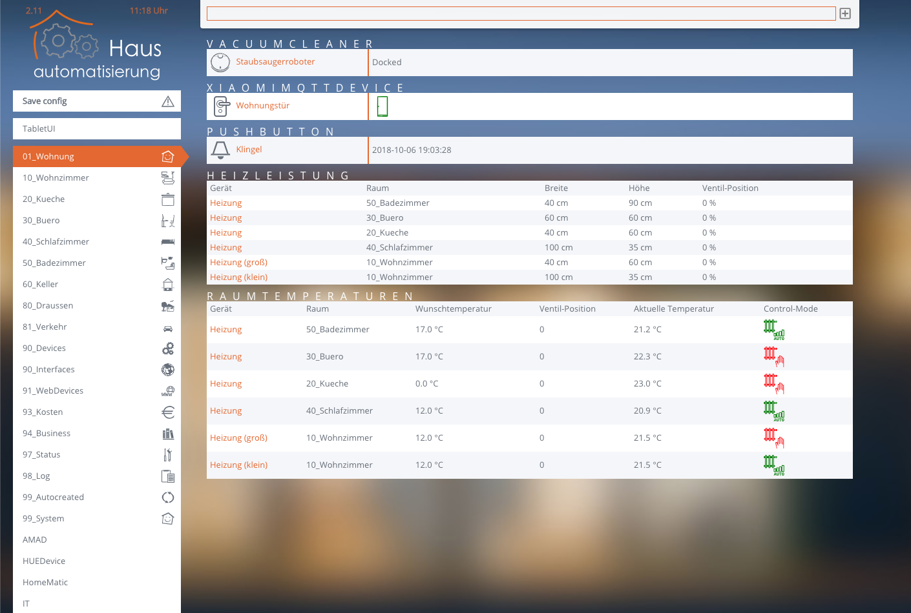

# FHEM Style: haus-automatisierung.com

Version: 2.20 | [CHANGELOG](CHANGED) | [CONTRIBUTE](CONTRIBUTE.md) | [LICENSE](LICENSE)

**Dies ist eine angepasste Version.**

**Alle Rechte gehören weiterhin dem Ersteller des ursprünglichem Theme - [klein0r/fhem-style-haus-automatisierung](https://github.com/klein0r/fhem-style-haus-automatisierung)**


## Installation

1. Hinzufügen des Themes

```
update add https://raw.githubusercontent.com/ole1986/fhem-style-haus-automatisierung/master/controls_ha_theme_ole1986.txt
update check ha_theme_ole1986
update all ha_theme_ole1986
```

2. Select Style -> hausautomatisierung_com

3. Support für CodeMirror

```
attr WEB JavaScripts codemirror/fhem_codemirror.js
attr WEB codemirrorParam { "theme": "blackboard", "lineNumbers":true, "lineWrapping": true, "height": "auto", "autocomplete": true }
attr WEB roomIcons Save.config:message_attention
```

4. Konfiguration speichern und `shutdown restart` ausführen

## Smart-Home-Icons:

Thanks @ https://dribbble.com/shots/2084609-Smart-House-Icon-Set-Free

## Fehler melden

Bitte [hier](https://github.com/klein0r/fhem-style-haus-automatisierung/issues) einen Issue erstellen

## Vorschau



*Desktop Version*


*Mobile version*
